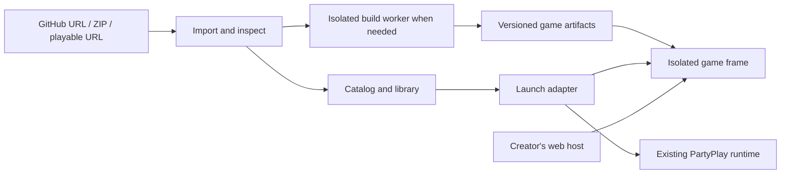

# Party Place: games as independent releases

2026-09-10. Architecture proposal following the playable nine-game prototype. The landing artwork change is implemented; the import and hosting system described below is proposed.

Party Place should discover, organize, and launch games supplied by creators. A game should be able to enter the catalog without becoming a source dependency of the platform. Browser compatibility is the launch requirement; our PartyPlay room protocol is an optional integration.

## Where the prototype is coupled

Both `apps/party-client/src/registry.ts` and `apps/party-server/src/registry.ts` import every supported game. `apps/party-client/src/catalog.ts` derives listings from room manifests and contains game-specific descriptions, categories, and capability decisions. `dashboard.tsx` and `game-page.tsx` select illustrations by game ID. Every launch currently creates or uses a PartyPlay room.

This worked for seeding the existing games. Adding a third-party game currently requires source edits and rebuilding the platform. The next architecture should make adding a game a data operation. Existing trusted games can keep their runtime while that boundary changes.

## What happens after pasting a GitHub URL

1. Resolve the repository, optional subdirectory and chosen revision. Read metadata, README, package/build configuration, release assets and any supplied manifest. Treat repository content as data; importing a listing must not execute its scripts.
2. Present the detected title, creator, artwork and playable target. Uncertain fields remain editable; if there are several plausible entry points, ask which game to import.
3. Add a private library record immediately. Show whether it is ready, needs building, or needs a browser export. Saving a link and publishing a working game are separate operations.
4. Resolve a release using one of the paths below, then launch it when ready.

| What the creator supplies | How it plays | Where game files live |
| --- | --- | --- |
| Existing web deployment, including GitHub Pages | Load the approved playable URL in an isolated frame, with an external launch fallback if embedding is blocked | Creator's host |
| ZIP or release asset containing a built web game | Validate and unpack its HTML, JS, WASM and assets; publish an immutable release | Separate game artifact storage/CDN |
| Repository containing source, such as a Vite project | Build a pinned commit in an isolated worker; validate and publish the output | Source on GitHub, compiled release in artifact storage |
| Native-only project or server-dependent game | Require a browser export or an independently deployed backend; explain what is missing | Depends on creator's deployment |

GitHub Pages publishes static HTML, CSS and JavaScript and can run a build process before publication. That makes an existing Pages deployment a useful first import path. [GitHub Pages documentation](https://docs.github.com/en/pages/getting-started-with-github-pages/what-is-github-pages).

GitHub's archive API lets us fetch a repository at a specific reference. Fetching source is only the acquisition step: an archive does not become a website until its files are built when necessary and served with working asset paths and response headers. [GitHub repository archive API](https://docs.github.com/en/rest/repos/contents#download-a-repository-archive-zip).

A browser-only ZIP loader is possible for a constrained static format, but resolving relative imports, workers, WASM, assets, storage and offline behavior makes it a poor universal first implementation. Do not fetch and rebuild GitHub source for every play. Resolve branches to commits, build once, cache the release, and retain the previous release for rollback. Author-hosted URLs remain mutable unless the author provides versioned URLs; mark that distinction.

## Keep these responsibilities separate

The catalog stores game identity, creator, artwork URLs, tags and descriptions. A release stores provenance, commit or artifact hash, entry point, launch kind, required capabilities and compatibility status. A library stores the user's relationship to a game, preferred release and save references. Search and cards should depend only on catalog records.

Use a small set of launch adapters: `web` for a playable URL or hosted static artifact, and `party-room` for the current games. A source provider such as GitHub resolves inputs into releases; it is independent of the launch adapter. This lets future sources share the same import, catalog and player behavior.

The first migration can keep the nine games bundled behind `party-room`, while external web games launch without a room. Later, move the trusted collection into an independently deployed runtime. Reusing the same friend group across games is a platform session feature; reusing the existing room code does not mean arbitrary third-party games automatically speak its networking protocol.

## Optional manifest, optional SDK

Always maintain a normalized internal release record. Do not require authors to write it. Detect conventional entry points and common build systems, then let the importer confirm or correct the result. An optional versioned manifest supplies otherwise ambiguous information: game subdirectory, build command/output, start page, artwork, controls and capabilities. A source repository's `index.html` can still require bundling; finding that filename alone is insufficient.

An optional SDK connects the game to platform services: ready/error signals, pause requests, sound preferences, save export/import, identity and multiplayer/controller features. A game with no SDK can still launch. The platform cannot promise to pause, save or modify an arbitrary game without cooperation from that game.

Use an isolated origin for each unrelated game, separate from platform accounts and from other games. Embedded code must not receive platform credentials. A narrowly scoped bridge can use `postMessage`, checking the sending window, exact origin, protocol version and allowed operations. Storage and embedding policy need an explicit compatibility test; do not enable every iframe permission by default. [MDN iframe documentation](https://developer.mozilla.org/en-US/docs/Web/HTML/Reference/Elements/iframe), [MDN postMessage documentation](https://developer.mozilla.org/en-US/docs/Web/API/Window/postMessage).

Build workers execute untrusted repository scripts, so they need disposable isolation, resource limits, controlled network access and no platform secrets. Downloads and ZIP extraction need size/path checks; URL inspection must reject private-network targets and recheck redirects. This is why a general GitHub builder belongs outside the catalog server.

## Saves, offline play and remixing

Existing game-owned browser storage may work, depending on embedding and browser policy, but it is not automatically a portable cloud save. For integrated saves, namespace by user, game, fork and save-schema version. Keep stable per-game origins across compatible releases; upgrades need explicit migration or rollback behavior. Multiplayer world state also needs its server, even when client assets are cached.

Offline availability should describe a tested release with all needed assets and a supported installation method. A source ZIP is different from a playable download. Only offer redistribution or remix actions when the applicable code and asset permissions support them. Record attribution and license information with the release rather than assuming a public repository licenses everything it contains.

A remix creates a fork with its own release history and attribution. Keep the original playable, preserve its pinned version, and let the user choose whether to copy a compatible save. Do not silently replace a library game or interpret generic source edits as a working mod system.

## First implementation slice

1. Make the catalog independent of room manifests, with creator-supplied artwork and a generic fallback. Keep the current games working through their existing adapter.
2. Add playable-URL imports and a minimal sandboxed web player with loading, fullscreen, exit and failure states. A fresh listing should appear without rebuilding Party Place.
3. Add GitHub resolution for existing deployments and prebuilt web releases, plus validated ZIP upload. The same import flow should report missing requirements clearly.
4. Add isolated builds for a narrow, documented set of project types, starting with common static/Vite games. Add broader engines after real examples establish requirements.
5. Add optional save integration, verified offline releases and a thin MCP interface over the same import/publish API. MCP should remove repetitive author steps; it should not be the only way to add a game.

The acceptance test for the architecture is importing a third-party web game, seeing it in the library, and playing it without editing either registry, creating a PartyPlay room, or rebuilding the platform. Verify a second imported game cannot read the first game's saves or platform session. Preserve ordinary play and the shared room for the original nine games.

## Landing-page change in this turn

The large racing illustration is replaced with static abstract portal artwork. Kart Party uses the same card size as other games. The existing layout, colors, search, favorites and launch controls remain. The illustration is an original inline SVG with no downloaded assets or extra dependency. Removed the unused racing-hero animation and featured-card styles.
