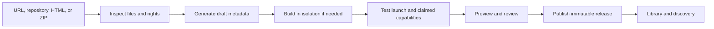

# A platform for discovering, keeping, and remixing vibe-coded games

## Recommendation

Build a player-facing home for the wave of vibe-coded games, starting with Astra creators and browser games. The initial promise should be: **find something worth playing, start quickly, keep it in your library, and return to it later.** Downloads, portable saves, and personal remixes should become visible advantages for games that support them.

Start as an actively curated service with a small collection of playable releases. Accept an existing game URL, repository, HTML file, or ZIP. Create the metadata on the creator’s behalf. Add a lightweight publishing API and CLI, then expose that same workflow through MCP so a creator can tell their coding agent to prepare and publish a game. Keep the runtime open to multiple tools and engines even while the launch community concentrates on Astra.

There is already competition at the discovery layer. MartinDelophy’s community catalog lists 61 Astra games and interactive projects in its September 9, 2026 update, alongside creator attribution and submission instructions. It explicitly distinguishes creator claims from independently established facts. This is a useful acquisition source and evidence of supply, but it is not evidence of sustained player demand. [1](https://github.com/MartinDelophy/awesome-gpt-6-astra)

The opportunity is to turn scattered demonstrations into a dependable game library. The difficult work is preserving working releases, establishing rights, filtering for enjoyable play, and handling updates without losing progress. An attractive grid and a submission form are necessary but easy to reproduce.

| Question | Recommended answer |
| --- | --- |
| Should the launch focus on Astra? | Yes, for community, editorial coverage, and creator acquisition. Store the model as optional provenance rather than a runtime requirement. |
| Can games enter without a manifest? | Yes. Generate a platform record from the URL or files. Require enough verified metadata internally; do not require creators to write it. |
| Can anyone nominate someone else’s game? | Yes, into a review queue. Nomination does not confer publishing rights or ownership. |
| Can open-source games be hosted and downloaded? | Often, subject to the actual code, dependency, asset, and other applicable rights. Public source alone is insufficient. |
| Does a download guarantee offline play? | No. Test the release without network access and disclose which modes work. |
| Can every game resume? | No. Offer browser-local persistence, portable checkpoints, and cloud sync as distinct capabilities. |
| Are source extensions useful? | Yes. Start with data-only catalogs and curated connectors. Defer arbitrary executable extensions. |
| Is MCP the best submission interface? | It is particularly useful for this creator cohort, but should call the same publishing service as the website, CLI, and CI integrations. |
| Should games adopt PartyPlay’s room protocol? | Only when they want its party-game capabilities. Arbitrary imported games need an independent launch path. |
| What should come first? | Curated instant play, accurate compatibility information, creator credit, and a useful personal library. Prove a few downloads and saves before promising universal support. |

## 1. The audience and the product

The first audience is people encountering impressive game clips and links in the Astra community. Some want a few minutes of entertainment. Others want to see what is possible, inspect a project, or adapt a game for friends. These are related needs, but the homepage should make playing easy without requiring an interest in development.

For players, organize discovery around situations: five minutes available, playable on this phone, controller supported, something for two people, a longer game with checkpoints, or a game that works offline. Genre and model tags help, but compatibility and session length determine whether someone can actually play now. Show experimental projects in an explicitly labeled area so an unfinished demo does not silently carry the same promise as a complete game.

For creators, the immediate value is distribution and useful feedback. The platform should provide a shareable game page, a working build, attribution, playability diagnostics, and evidence that real people played. A creator who just finished a game should not need to learn a second development framework or rewrite it to match a party-game API.

Open source is a practical bootstrap strategy and a useful player filter, not a requirement for every creator. Accept authorized closed-source games for the activities their authors permit. This keeps the audience focused on vibe-coded games while making openness, offline support, and remixability meaningful additional capabilities.

For curators, the valuable tools are nomination, collections, release inspection, duplicate detection, and an author-claim workflow. A public collection such as “This week’s Astra games” can be a distribution channel. Avoid requiring players to configure sources before the first enjoyable session.

### A concrete player journey

A visitor follows a clip to a game page. It shows a short description, actual gameplay, creator, controls, tested devices, and whether progress survives closing the game. They select Play and reach the game without creating an account. After playing, they save it to their library; an account becomes useful when they want that library or supported saves on another device.

On a later visit, the library offers Continue only where an actual saved checkpoint exists. A different game might say Play again, because it stores only a high score. A download button describes a tested offline mode and its size. A Make my version action explains what can be changed and creates a separate copy with its own saves.

These distinctions should be expressed in ordinary language. “Saves on this device,” “Syncs across devices,” “Works offline after download,” and “Source available for remixing” are more useful than one vague “supported” badge.

## 2. What already exists, and where to compete

| Reference | Established behavior | Implication for this platform |
| --- | --- | --- |
| Astra community catalogs | Collections already gather new games, creator links, demos, and creation notes. [1](https://github.com/MartinDelophy/awesome-gpt-6-astra) | Treat them as potential collaborators and sources. A list alone is a weak differentiator. |
| itch.io | Browser uploads accept a ZIP containing `index.html`, or a self-contained HTML file. Its desktop launch manifest is optional, and its app supports installing games and browsing a personal library. [7](https://itch.io/docs/creators/html5), [8](https://itch.io/docs/itch/integrating/manifest.html), [9](https://itch.io/docs/itch/using/downloading.html) | Low-friction publishing and downloadable libraries already have strong precedents. Offer a better workflow for newly generated projects and their subsequent revisions. |
| CrazyGames | Basic Launch can start without platform-specific integration; Full Launch requires deeper integration. Its SDK supports progress and account features. [10](https://docs.crazygames.com/requirements/intro/), [11](https://docs.crazygames.com/requirements/technical/) | Progressive integration is a practical pattern. Do not make an SDK the price of initial admission. |
| Poki | Offers developer playtesting, QA, analytics, acquisition, and monetization support. [12](https://developers.poki.com/) | Developers want players and feedback, not only somewhere to upload files. |
| Rosebud | Its published guide describes community discovery, play, project remixing, and code export. The guide dates to May 2025; plan entitlements should be checked separately. [13](https://lab.rosebud.ai/blog/beginner-guide) | Creation plus discovery plus remixing is already a product category. Cross-tool importing and release portability are the more specific opportunity. |
| Astrocade | Its creator page promotes built-in distribution, analytics, game jams, and creator earnings. [36](https://www.astrocade.com/creators) | Competing for vibe-coded games also means competing for creator attention and support. An upload endpoint alone is not enough. |
| Steam Cloud | Supports API integration or configuration of save-file locations through Auto-Cloud. [14](https://partner.steamgames.com/doc/features/cloud?language=english) | Even mature save systems need a contract about which state to preserve. |
| Playnite and Ludusavi | Playnite integrates libraries and metadata through extensions. Ludusavi backs up game saves using manifests and supports community additions. [15](https://api.playnite.link/docs/manual/features/extensionsSupport/extensionsSupportOverview.html), [16](https://github.com/mtkennerly/ludusavi) | A unified library and community-maintained compatibility metadata are useful precedents, especially for later desktop support. |

Position the product around **playable, credited, revisitable creations**, with an Astra-focused opening collection. Avoid making the brand dependent on a particular model name: creators will use mixtures of coding models, engines, image tools, and existing assets. Preserve that history where authors want to share it, without ranking games by unverifiable claims about how little work they required.

The strongest defensible assets would be creator relationships, reliable compatibility records, a library people return to, and a meaningful collection of remixes and updates. A publishing protocol can support these assets; the protocol itself will not produce demand.

Offline library access is also not a new category: itch documents remembered profiles, local library browsing, and launching games while offline. Its documentation does not establish that every installed game is network-independent. The opportunity is the combination of a focused new-game community and explicit, tested portability, not a claim to have invented offline game libraries. [39](https://itch.io/docs/itch/using/offline.html)

## 3. A real starting collection

The following are research candidates, not an approved catalog. Their repositories and documentation were inspected; they were not built or playtested for this report. Model participation is creator-reported. License observations apply to the inspected revisions and do not replace a complete dependency and asset review.

| Candidate | Evidence and import potential | Important limit |
| --- | --- | --- |
| **Last Beacon**, stackloomdev | Browser tower defense. Its README attributes development to Astra and states that original code and procedural assets use MIT. It documents a static build and a self-contained offline HTML export. [2](https://github.com/stackloomdev/last-beacon), [3](https://github.com/stackloomdev/last-beacon/blob/102ca4cfca542f9cca7a6020b12e20db78ac0003/LICENSE) | The documented persistence keeps records, not the ongoing run; refresh starts a new game. A good first offline candidate, but not a resume demonstration without additional work. |
| **CityMaker**, Derek Wang | Procedural 3D city-themed 2048. The project documents Astra’s role in geometry, MIT for its source and original models, and per-city IndexedDB progress. [4](https://github.com/derek-wangpch/OpenCityMaker), [5](https://github.com/derek-wangpch/OpenCityMaker/blob/ca45404de679baf5afb6b2504ef3c0af27b64ffc/LICENSE) | Its README explicitly says saves do not sync across devices and there is no service worker providing guaranteed offline loading. Package fonts/dependencies appropriately and test storage migration. |
| **THUNDERFALL**, jackroc | Browser shooter with a static module build. Its project-specific README explicitly applies CC0 to original code, procedural visuals, and synthesized sound; metadata records creator-declared Astra use. [6](https://github.com/MartinDelophy/awesome-gpt-6-astra/blob/main/works/thunderfall/README.md) | Requires serving JavaScript modules over HTTP; copying `index.html` alone is insufficient. Documented scores and preferences do not establish portable campaign checkpoints. |
| **Mosswing / Melon Lab**, Ayi1337 | Author-published Astra experiments with source and standalone HTML. [17](https://github.com/Ayi1337/gpt6-astra-one-shot-games/tree/4178b08d569372a1492878d73c6018a90f564e5b) | No project-wide license was found in the inspected tree. A dependency’s Three.js license is not permission for the whole game. Clarify redistribution and remix rights before mirroring. |
| **Magic Carpet Wizard**, threapchills | Creator describes an Astra-built Three.js game and provides buildable source. [18](https://github.com/threapchills/MagicCarpetWizard/tree/224e702b7a5e85f08361db8e5ec23a5f11813364) | No project-wide license was found in the inspected tree. The README also describes supplied audio, requiring separate rights clarification. Begin with a creator conversation or reviewed outbound listing. |

The inspected commits were `102ca4cfca542f9cca7a6020b12e20db78ac0003` for Last Beacon, `ca45404de679baf5afb6b2504ef3c0af27b64ffc` for CityMaker, `4178b08d569372a1492878d73c6018a90f564e5b` for Ayi1337’s collection, and `224e702b7a5e85f08361db8e5ec23a5f11813364` for Magic Carpet Wizard. THUNDERFALL was inspected on its moving main branch and must be pinned before import.

Use established games only as engineering fixtures if helpful. 2048 has an explicit MIT license; Hextris declares GPL version 3 or later; A Dark Room uses MPL 2.0. They offer varied packaging and licensing cases, but do not test demand for a new Astra-focused collection. [19](https://github.com/gabrielecirulli/2048/blob/master/LICENSE.txt), [20](https://github.com/Hextris/hextris), [21](https://github.com/doublespeakgames/adarkroom/blob/main/LICENSE.md)

The practical acquisition loop is to find a compelling demo, locate its original author and source, record rights, run a bounded compatibility review, then offer a credited listing. Curator-added releases should say who packaged them. An author can later claim the page through repository or domain ownership verification. Claiming a page must not erase the original author, collaborators, or remix history.

## 4. Importing without forcing a manifest

**Require a normalized record inside the platform; make the repository manifest optional.** This separates what the platform needs to know from what a developer must manually supply.

Support four entry paths. A URL creates a proposed listing and, where permitted and technically supported, an external launch. An HTML file or ZIP creates a candidate static release. A repository import identifies the game root, build recipe, and output directory. A native executable can initially receive a reviewed external-download listing, while managed native installation remains a later product.

The importer can inspect `package.json`, lockfiles, `index.html`, engine export files, existing web manifests, READMEs, license files, and deployment configuration. It can propose title, screenshot, engine, entry point, and likely build settings. It should record where each value came from and whether it is inferred, author-declared, or tested.

It cannot safely infer legal permission from a public repository, offline support from a successful page load, complete save support from the presence of `localStorage`, or multiplayer capacity from a menu button. Ask short, targeted questions about unresolved facts instead of displaying a large blank form.

### Three different records

| Record | Purpose | Who can supply it? |
| --- | --- | --- |
| Game and release record | Identity, creator, immutable build, entry point, runtime, dependencies, rights, compatibility | Importer, author, or curator; platform validates before publication |
| Optional author manifest | Repeatable build instructions and declared capabilities stored with the project | Author or their coding agent; generated by the platform when requested |
| Source catalog manifest | Describes a collection provider and how its entries can be retrieved | Community curator or source operator |

A web app manifest already used for home-screen installation serves a different purpose. Read useful fields from it, but do not treat it as a game-distribution license, save contract, or build description.

For a first managed static release, store a stable game ID, creator attribution, source revision where applicable, artifact digest, launch entry, runtime type, distribution permission evidence, and review status. Store optional capabilities separately: tested inputs and devices, player modes, required network services, save integration, customization options, and remix ancestry. The author can start with a handful of fields because the platform creates the rest.

A game ID should survive repository renaming and hosting moves. A release identifies one immutable artifact. A remix gets its own game identity with a parent release reference. Sources can point to an existing identity; they should not silently create new canonical owners or replace trusted releases.

For example, an optional author file could be this small. This is an illustrative proposed format, not a final standard or a file creators must already have:

```json
{
  "schemaVersion": 1,
  "title": "My game",
  "runtime": "web-static",
  "build": { "command": "npm run build", "output": "dist" },
  "entry": "index.html",
  "licenseFile": "LICENSE",
  "declaredCapabilities": { "offline": true, "save": "local" }
}
```

The platform still assigns identity, records the artifact hash and source revision, reviews rights, and stores test results. An author’s `offline: true` claim requests verification; it does not grant an offline badge. Imported build commands execute only inside the isolated build service. Existing metadata should be reused when available, and a creator can export the generated file after their first successful import.

### Import pipeline



Preserve the submitted source and record any packaging changes. If an AI-assisted importer fixes a broken asset path, its output is a distinct build with a reviewable change, not an invisible alteration to the original release. Unsupported builds should fail with useful diagnostics or become external listings, rather than trigger unlimited autonomous repair.

## 5. Publishing with very little friction

The preferred creator flow is: **paste a link or ask the coding agent to publish; inspect the generated page; resolve only missing information; release.** “Low friction” should mean little manual work, not hidden ownership claims or automatic public release of unfinished work.

| Interface | Best use | Initial priority |
| --- | --- | --- |
| Website URL / HTML / ZIP submission | First-time creators and curator nominations | Essential |
| Repository connection | Repeated updates, source provenance, build automation | Early; read access scoped to selected repositories |
| CLI | Agent workflows, local build uploads, clear diagnostics | Early, using the same API |
| MCP server | Natural-language publishing from the creator’s existing agent | Early after one complete API workflow works |
| CI integration | Publishing release tags and approved updates | After initial creator testing |
| Engine export plugins | Godot or other engines with demonstrated submission volume | Add when repeated friction justifies each plugin |
| Browser extension | Save or nominate the current game page | Optional later convenience |

Provide one canonical publishing API. Illustrative MCP tools could be `inspect_project`, `create_draft`, `get_upload_url`, `validate_release`, `get_preview`, `publish_release`, and `get_release_status`. These are proposed tools, not existing PartyPlay APIs. Each should return structured errors that an agent can act on: missing entry, external dependency, ambiguous rights, unsupported server process, or failed save restoration.

A remote MCP server cannot read a local folder merely because an agent names its path. The local agent or CLI must package and upload files, or the service must fetch an explicitly connected repository. Use asynchronous jobs for builds and validation; return job IDs and progress instead of holding one fragile request open. Upload large artifacts directly to scoped storage rather than embedding them in tool arguments.

Keep draft creation separate from publication. Tie approval to the exact release digest, page metadata, and requested permissions. Later, creators may authorize automatic releases from a designated branch or tag, with renewed review when permissions or distribution terms change. Use idempotency so retries cannot create duplicate games or releases.

Use authenticated, narrowly scoped publishing permissions. The versioned MCP authorization specification covers HTTP authorization, resource-bound tokens, and discovery; its security guidance rejects token passthrough. Keep source-provider credentials separate from platform credentials. Treat repository text as untrusted input to the publishing agent, never as authority to publish, disclose secrets, or expand access. [22](https://modelcontextprotocol.io/specification/2025-11-25/basic/authorization), [23](https://modelcontextprotocol.io/docs/2025-11-25/tutorials/security/security_best_practices)

For this audience, also offer a small publishing skill with the supported formats, diagnostics, and release checklist. The skill explains the workflow; the API enforces it. A creator should be able to say, “Prepare this game for the platform, preserve its license, test the build, and show me the release page,” using their preferred coding tool.

## 6. Sources and extensions

The Stremio analogy is useful at the catalog layer. Its add-on protocol exposes a manifest and resource endpoints over HTTP, allowing a client to aggregate catalogs and metadata. That is a better starting point for discovery than installing arbitrary source code into every player’s application. [24](https://github.com/Stremio/stremio-addon-sdk/blob/master/docs/protocol.md)

Start with a documented JSON feed that can live on static hosting. A source identifies itself, supplies stable entry IDs, and links to game pages, releases, attribution, and rights evidence. An optional search endpoint can follow later. A curator should be able to publish “My favorite Astra games” without operating a custom game server.

The default experience should contain a maintained first-party catalog. Players can optionally add community sources, inspect their publisher and permissions, disable them, and see which results came from which source. Adding a source permits discovery; it should not automatically download, execute, or update every game it lists.

Prefer platform-maintained connectors for existing repository lists or approved APIs. If a source requires scraping, evaluate the site’s terms, rights, stability, and operating cost separately. A publicly reachable page is not an automatic content-import license. Keep connector execution away from game accounts and player data.

Do not copy the trust model of unrestricted executable extensions. Mihon’s own documentation warns that third-party extensions may have full app access and contain malware. Games add a second execution layer, making that choice particularly consequential here. [25](https://mihon.app/docs/faq/browse/extensions)

A mature source system needs namespaced IDs, duplicate handling, pagination, timeouts, last-success timestamps, deletion markers, and a clear distinction between unavailable and removed. A failed source should not erase a player’s library or saves. A source’s signature authenticates its publisher; it does not certify every linked game as safe or licensed. New release digests and increased permissions must pass the relevant review again.

Keep a separate emergency policy for a malicious or infringing release. Removing it from discovery, blocking new downloads, warning installed users, and disabling a managed launch are different actions. Do not erase personal saves as part of routine delisting. Offline installations cannot reliably receive an immediate recall, so describe the limits of any remote-disable mechanism honestly.

A public aggregation server also needs protection against source URLs targeting internal services, including through redirects and DNS changes. Direct requests from players reveal their IP addresses to sources; a proxy can improve privacy but creates cost and abuse exposure. Make that choice explicit before enabling arbitrary source URLs.

Open the catalog and release schemas early. Implement broad federation after independent curators show that they want to maintain sources. This preserves the option without making source infrastructure the first product people must understand.

## 7. Rights: play, host, download, and remix

Track distinct rights for listing metadata and imagery, embedding, hosting a playable copy, distributing binaries or web bundles, distributing source, modifying, and sharing modifications. Permission for one activity need not imply permission for the others. A proprietary author can authorize hosted play and offline downloads without publishing source; an open-source game may still depend on assets the platform cannot redistribute.

GitHub explains that a public repository without a license remains subject to default copyright restrictions, despite GitHub’s platform-specific viewing and forking permissions. An importer should flag missing or ambiguous licensing instead of choosing MIT for the author. [26](https://docs.github.com/en/repositories/managing-your-repositorys-settings-and-features/customizing-your-repository/licensing-a-repository)

| Rights pattern | Operational treatment |
| --- | --- |
| MIT or a similarly permissive software license | Preserve required notices and inspect dependencies and assets separately. MIT expressly permits modification and distribution subject to its notice condition. [27](https://opensource.org/license/mit) |
| GPL-covered game | Plan to provide the corresponding source and notices required for the distributed form; preserve applicable copyleft terms on covered derivatives. Do not assume the entire storefront becomes GPL merely because it distributes a separate GPL game. [28](https://raw.githubusercontent.com/Hextris/hextris/gh-pages/LICENSE.md) |
| MPL-covered code | Track covered files and source availability obligations when distributing modified or compiled forms. Browser-delivered minified JavaScript does not eliminate source obligations. [29](https://www.mozilla.org/en-US/MPL/2.0/FAQ/) |
| Creative Commons assets | Record the exact license. Attribution, ShareAlike, NonCommercial, and NoDerivatives conditions differ. Commercial hosting and publicly shared remixes need appropriate rights. [30](https://creativecommons.org/cc-licenses/) |
| Public source with no clear project license | Hold managed redistribution and public remixing for clarification; consider a reviewed link to the author’s own page. |
| Proprietary game with explicit distribution agreement | Enable the activities actually granted. Keep source downloading and remixing unavailable unless separately authorized. |

Store evidence per release: license text, attribution, dependency inventory, asset credits, source revision, and any author grant. A repository-wide license does not automatically resolve embedded audio, fonts, textures, trademarks, or copied characters. A license for a catalog also does not automatically cover every external game it links to.

AI involvement adds a separate copyright question. The U.S. Copyright Office’s January 2025 report distinguishes protectable human expression, arrangement, and modification from merely supplying prompts. This does not mean every vibe-coded game lacks copyright or that AI output is automatically free to copy. Record provenance and the creator’s actual grants; do not promise exclusive ownership or comprehensive rights merely because a repository contains a license file. Other jurisdictions require separate consideration. [37](https://www.copyright.gov/newsnet/2025/1060.html)

Offer an author-facing rights summary written in plain language. Ask the author to confirm what they control and what they are granting; allow custom restrictions instead of pretending every game is open source. Independent curator imports can rely on an existing sufficient license without requiring the author to join the platform, but should remain visibly curator-packaged.

For the public service, establish a rights complaint and appeal process, creator impersonation handling, and clear distribution terms before opening submissions widely. Have counsel review those terms and the initial licensed distribution patterns for the launch jurisdictions. The tables above are product requirements, not a clearance opinion on any particular game.

## 8. Runtime architecture and isolation

Treat the platform as three systems with explicit boundaries: a catalog and account service, an import/build/review service, and a game execution environment. Do not let arbitrary imported JavaScript or server modules execute inside the trusted launcher or its backend.

For managed browser games, use a dedicated game-serving domain separate from the account application, with isolated origins or equivalent storage partitions per game. Account cookies should not be shared with game hosts. Use immutable release URLs and restrictive frame permissions. Validate every bridge message against the expected window, origin, schema, and session; only offer the small set of capabilities that game is allowed to use.

An iframe sandbox is useful but requires deliberate configuration. Removing same-origin privileges can break storage and browser APIs. Giving scripts and same-origin privileges to content on the launcher’s own origin defeats the intended boundary. MDN documents this pitfall; serve untrusted games from a separate origin and test required capabilities there. [31](https://developer.mozilla.org/en-US/docs/Web/HTML/Reference/Elements/iframe)

Some games will need their own top-level launch page. Threaded WebAssembly exports can require cross-origin isolation headers and compatible resources. Godot’s documentation distinguishes these requirements from its more compatible single-threaded web exports. Advertise tested runtime profiles instead of claiming all HTML or WebAssembly games work in one iframe. [32](https://docs.godotengine.org/en/4.6/tutorials/export/exporting_for_web.html)

Build jobs are also untrusted execution. Prefer prebuilt static uploads for the simplest path. For source builds, use short-lived isolated workers with no production credentials, bounded CPU, memory, time, and output size, and restricted outbound access. Inspect archive paths, symlinks, expansion size, and file counts before extraction. Dependency installation and build scripts are executable code even when the final product is static.

Repository provenance can make a build easier to audit, but does not make it trusted. Apply isolation to repository builds and uploaded bundles alike. Pin source revisions and build tooling, preserve available attestations, and distinguish “known source” from “reviewed release.” Start with a no-external-network runtime profile for self-contained games; introduce narrowly scoped network permissions only when a supported game needs them.

Review external network dependencies and permissions, including camera, microphone, clipboard, fullscreen, pointer lock, and gamepad use. A static game that only needs input and audio should not receive account access or a broad native bridge. A clean scan is useful evidence, not a guarantee against malicious behavior.

Server-dependent games need their own track: author-hosted backends initially, or separately isolated managed game services later. Record backend health and ongoing costs. Never run submitted Node.js rules inside the existing PartyPlay server process. A public multiplayer service also needs persistent identities, many simultaneous rooms, abuse controls, scaling, and deployment security beyond the local room implementation.

## 9. Offline play and downloads

An offline release must contain the playable artifact and required local dependencies, and its advertised mode must work without the internet. A source ZIP is useful to developers but is not necessarily a playable installation. A game using online matchmaking, hosted saves, a model API, or server-authoritative rules may need a different local mode or remain online-only.

Offer a progression of support:

| Delivery | Benefit | Limit |
| --- | --- | --- |
| Author’s external game page | Fastest way to add discovery | Platform cannot promise availability, updates, downloads, or saves |
| Platform-hosted static release | Stable, inspectable browser artifact | Offline loading still needs an explicit installation/caching path |
| Downloadable standalone HTML or packaged web build | Portable file ownership for suitable games | Some builds require a local HTTP runtime rather than opening a file directly |
| Browser offline installation | No desktop app required; cached assets can run locally | Browser storage policies, origin scope, and platform differences require testing |
| Desktop library application | Managed packages, local storage, version selection, later local servers | Application distribution, updates, runtime security, and per-OS QA add substantial work |

Service workers support cached offline applications, but they are scoped to an origin and require a secure context. A service worker on the catalog cannot simply control arbitrary third-party game origins. Browser storage is generally best-effort unless persistence is granted, and users can delete it. Offer export/backup and clear installation status rather than treating cache as permanent ownership. [33](https://developer.mozilla.org/en-US/docs/Web/API/Service_Worker_API/Using_Service_Workers), [34](https://developer.mozilla.org/en-US/docs/Web/API/Storage_API/Storage_quotas_and_eviction_criteria)

Keep signed or otherwise authenticated release metadata, artifact digests, atomic installation, and rollback. A digest establishes exact bytes; it does not establish that those bytes are trustworthy. Preserve the installed version until an update is downloaded and validated, and never replace a running game halfway through a session.

If a desktop app is introduced, keep untrusted games out of Node-enabled renderers and expose only narrow, validated capabilities. Electron’s security guidance requires particular care with remote content, context isolation, sandboxing, navigation, and IPC. Choosing Electron or another wrapper does not by itself make arbitrary downloads safe. [35](https://www.electronjs.org/docs/latest/tutorial/security)

Acceptance for an offline badge should include installing from a clean profile, closing the game, disconnecting the network, cold-launching, playing the advertised mode, saving where supported, restarting, and restoring. Test delayed asset loading and later levels, not only the opening screen. For local multiplayer, distinguish “no internet required” from “no network required”: LAN play still requires local connectivity.

## 10. Saving, resuming, and updates

Saving is likely to provide more lasting value than an endless stream of new releases, but it must mean something specific. There are at least four different promises: remembering settings or a score, restoring a completed checkpoint, continuing on another device, and suspending an exact running simulation. Implement the first three where supported. Arbitrary exact suspension is not a realistic generic browser feature.

| Integration level | Platform can offer | Required evidence |
| --- | --- | --- |
| No integration | Recently played and a bookmark | No claim of game-state recovery |
| Existing browser persistence | Progress on the same supported origin/profile | Reload and restart tests; stable origin |
| Reviewed adapter | Export/import of a known game’s save format | Correct keys/files, schema validation, round-trip tests |
| Optional save API | Portable checkpoints, slots, backups, cloud sync | Game-controlled serialization and compatible loading |
| Server-authoritative world | Host or group restoration under game rules | Backend checkpoint, authority, roster, and version handling |

A generic parent page cannot read a cross-origin game’s localStorage or IndexedDB. A browser storage dump also cannot safely identify which values are progress rather than credentials, analytics, or machine-specific settings. Do not solve this by intercepting every storage operation and synchronizing everything. Steam’s configured save paths and Ludusavi’s manifests illustrate the value of explicit or community-maintained save knowledge. [14](https://partner.steamgames.com/doc/features/cloud?language=english), [16](https://github.com/mtkennerly/ludusavi)

An optional save API should let the game read and write an opaque, size-bounded checkpoint. The platform manages durability and synchronization; the game owns what constitutes valid state. Attach game ID, release compatibility, schema version, slot, revision, creation time, and integrity information. Store saves separately from installed game files so updates or uninstalls cannot silently destroy them.

Bind access to the authenticated player and launched game on the service side; do not trust a game-supplied player or game ID to choose whose saves it can access. Apply quotas and deletion/export controls. Treat imported saves as untrusted data, and execute game-provided migrations inside the game’s isolation boundary rather than in the privileged save service.

Save locally first and queue supported cloud synchronization. Make “saved on this device” distinguishable from “synced.” Use revision checks to detect concurrent changes. If two offline devices progress independently, preserve both branches and let the player choose; wall-clock last-write-wins can destroy hours of progress. Do not merge arbitrary JSON unless the game supplies a well-defined merge operation.

Keep previous checkpoints and take a backup before migration. New releases should declare which save schemas they can load and provide tested migrations when needed. Pin a compatible release for an old save if migration is unavailable. Whether versions share one game origin or use separate release origins, storage continuity must be deliberate: shared origins ease persistence but expose old state to new releases; separate origins require explicit transfer.

Save at game-defined safe points. A page-close event is not reliable enough to be the only write opportunity. Avoid treating pause as serialization: timers, random-number state, pending events, physics, and inventories may all matter. In multiplayer, decide whether the save belongs to the host, a group, or a player, and whether restoration requires the same roster. A multiplayer world cannot usually resume just by restoring one phone’s browser state.

## 11. Making a game your own

Offer three levels of customization. First, expose settings the author already supports: difficulty, time limits, colors, control mappings, or accessibility options. Second, support explicit content packs or mods for games designed to load them. Third, allow a licensed source fork that a coding agent can modify and build as a distinct release.

The first level is the best way to make customization approachable. An author-provided settings schema can power controls such as “slower enemies” or “longer turns” without generating code. It also creates predictable sharing: friends can launch the same game release and settings without needing separate forks for every small change.

For source remixes, start with a private copy of a pinned release. Preserve the original and its saves. Let the player request a change, inspect a preview, and keep or discard the result. Public sharing should undergo the same rights and execution review as any new release. Link the remix to its parent and clearly distinguish original creator from modifier and packager.

The coding agent may need source, build instructions, and selected assets, but should not receive the player’s full account, unrelated saves, or secrets. Sending private source to an external model is a separate data-sharing decision. A “Make my version” action can initially download a reproducible source package and instructions for the user’s existing tool; a hosted editor can follow after demand is demonstrated.

Forks should not silently receive upstream updates. Offer a deliberate rebase or merge workflow with preview and rollback. Save compatibility between a fork and its parent is not guaranteed. A casual solo modification can be useful even when its results are ineligible for the original game’s leaderboard; shared multiplayer sessions should agree on the same release and mod set.

The most compelling demonstration would be small and concrete: play a new Astra game, keep progress, make a gentler version for a child or a harder version for friends, and share that version with clear credit. Do not promise arbitrary modifications are instant or always successful.

## 12. How this relates to the current PartyPlay code

The existing application is a useful first collection and a reference implementation for one game family. It is not yet an ingestion or public distribution platform.

| Existing component | Useful foundation | Needed change for the broader platform |
| --- | --- | --- |
| [Catalog metadata](/Users/joshthemenace/Documents/ChatGPT/partyplay/apps/party-client/src/catalog.ts) | Search, player counts, controls, categories, and two launch paths | Separate public game/release records from room-game metadata; support external and isolated web launches |
| [Client registry](/Users/joshthemenace/Documents/ChatGPT/partyplay/apps/party-client/src/registry.ts) | Explicit lazy loading of trusted bundled games | Retain it for built-ins; add a separate execution boundary for imported releases |
| [Server registry](/Users/joshthemenace/Documents/ChatGPT/partyplay/apps/party-server/src/registry.ts) | Explicit trusted server-rule allowlist | Never turn this into dynamic execution of arbitrary submitted server code |
| [Game contract](/Users/joshthemenace/Documents/ChatGPT/partyplay/packages/party-contract/src/index.ts) | Rules, rendering views, input, optional save/load hooks | Keep it as an optional party runtime, independent of a general distribution manifest |
| [Recovery store](/Users/joshthemenace/Documents/ChatGPT/partyplay/apps/party-server/src/recovery-store.ts) | Durable latest/previous world checkpoints with validation | General accounts, multiple slots/worlds, ownership, synchronization, and migrations require separate design |
| [Server entry](/Users/joshthemenace/Documents/ChatGPT/partyplay/apps/party-server/src/main.ts) | HTTP catalog plus local runtime hosting | Public identities, deployment security, ingestion, and concurrent sessions are additional systems |

The current documentation describes nine catalog games: eight use the shared room runtime, while Kart Party retains its own racing protocol. The shared room is in memory; Blockwild has durable recovery, but the application has no provisioned public account or multi-tenant hosting system. These constraints are confirmed by the explicit registries and recovery code. [Local implementation reference](/Users/joshthemenace/Documents/ChatGPT/partyplay/docs/party-platform/IMPLEMENTATION.md)

There is an especially useful save pattern already present: the recovery store owns the outer checkpoint metadata, while [Blockwild’s serializer and loader](/Users/joshthemenace/Documents/ChatGPT/partyplay/packages/games/blockwild/src/server.ts:111) own a versioned game payload and migrate version 1 into version 2. Generalize that division of responsibility, rather than trying to make the platform understand every game’s internal state.

Apply the same rights standards to the seed collection. No top-level project license was found during inspection. Font license texts are present, while [Kart Party’s reference](/Users/joshthemenace/Documents/ChatGPT/partyplay/modules/kart-party/REFERENCE.md:25) describes supplied generated recordings without establishing their redistribution terms. This is a documentation and permission gap, not a finding of infringement. Before publicly distributing these games, choose the intended code licenses and record the relevant asset grants, including the music source’s applicable terms.

The cleanest architectural direction is a general catalog and library above multiple launch adapters. One adapter launches trusted PartyPlay games. Another launches isolated static web releases. An external adapter opens an author’s page. Later adapters can manage desktop packages or supported local servers. This preserves the working party collection without forcing unrelated games into its lifecycle.

The first implementation experiment should import one licensed static game through that new boundary, not edit both game registries to add another trusted module. That experiment tests the architecture the new platform actually needs.

Use a database for catalog identities, release metadata, rights records, library entries, and review state; object storage for immutable builds and source archives; and a queue for bounded build and QA jobs. Start with ordinary database search and editorial collections. There is no need for a separate recommendation service, plugin marketplace, or distributed game-server scheduler to validate the first collection.

## 13. Curation, trust, and discovery quality

The scarce resource is player attention. A large automated influx of nearly identical games can make discovery worse even when every upload successfully builds. Keep public indexing distinct from technically accepting an upload: drafts and unlisted previews can be easy, while featured discovery requires playable quality and appropriate rights.

Create a small quality rubric: reaches meaningful play, controls work, objective is understandable, advertised device works, no blocking progression failure, and the page accurately describes completion state. Inspect the actual release, not a promotional video. An automated browser reaching a start screen is not equivalent to a human enjoying a full loop.

Rank early collections editorially and use diverse exposure for new creators. Once traffic exists, measure launch success, meaningful first play, return visits, saves, completion where applicable, and reports. Do not rank solely by raw playtime or social likes; those can favor long idle games, popular creators, or misleading clips. Associate compatibility reports with releases so a fixed bug does not permanently define a game.

Provide creator attribution, impersonation reporting, malware reporting, rights complaints, and moderation appeals. Treat model attribution as a labeled claim with an optional evidence link. Do not demand full private chat histories to prove someone used Astra, and do not let unsupported “one-shot” claims substitute for playability.

F-Droid offers a useful labeling precedent: disclose characteristics some players may reject, even when those characteristics do not block inclusion. Adapt the idea to games with ads, tracking, required online services, paid runtime model calls, or non-redistributable assets. Use neutral player-facing descriptions and filters, not one simplistic “open” badge. [38](https://f-droid.org/docs/Anti-Features/)

For a first public beta, keep social features narrow: share links, collections, follows, and structured feedback. Defer open chat and direct messaging. Define the intended audience and content policy before collecting accounts; age-related privacy and moderation obligations depend on launch markets and whether children are intentionally served.

## 14. Business model and operating costs

First prove that people return to play. A platform containing freely redistributable games can still sell useful services, but the paid value must survive the fact that people may legally obtain those games elsewhere.

Possible revenue sources include optional player cloud storage and longer save history, creator build/hosting plans, private collections, and explicitly priced hosted remix computation. Creator support links can be an early experiment. A paid game marketplace, ad network, or automatic revenue sharing across remix ancestry adds payment, fraud, tax, rights, and dispute work; defer it until there is demonstrated demand.

Keep ordinary play independent of model inference whenever possible. A game made with AI does not necessarily call an AI model while running. For hosted remixing or games with runtime model calls, meter and disclose the cost; unlimited generation can dominate otherwise inexpensive static hosting.

Use a bottom-up cost model rather than a top-down gaming-market estimate:

`monthly cost = artifact storage + asset delivery + build minutes + save storage/requests + backend runtime + moderation/support + optional model usage`

For scale intuition, 100,000 cold plays fetching an average 20 MB imply about 2 TB of asset delivery before repeat-play caching effects. Ten thousand players keeping ten 200 KB saves imply about 20 GB before replicas, metadata, and history. At 1,000 submissions per month, ten minutes of human review each means roughly 167 hours of review. These are illustrative workload assumptions, not traffic forecasts or vendor quotes.

The last number matters: low-friction authoring can overwhelm human review sooner than storage. Set upload quotas, bounded build retries, clear rejection reasons, and a deliberate featured catalog. Measure cost per accepted release and per returning player. Verify vendor prices when choosing deployment infrastructure; this report does not assume a particular provider or pricing plan.

## 15. A staged launch

The sequence below assumes a small team with the current application as a starting asset. These are stages and acceptance gates, not calendar commitments.

| Stage | Deliverable | Evidence needed to continue |
| --- | --- | --- |
| 1. Curated pilot | Roughly 10–20 recent vibe-coded games; original author credit; working links; compatibility labels; a simple library | Observe new players finding and starting suitable games, then returning without personal prompting |
| 2. Managed browser releases | A few licensed static imports, immutable builds, isolated execution, previews, downloads where tested | Repeatable imports without bespoke platform code; successful cold launches and accurate rights records |
| 3. Creator publishing | Website, CLI, API, and thin MCP workflow; generated metadata; author claims | Creators publish and update without staff operating their machines or repairing each project |
| 4. Portable progress | Optional save API plus a few reviewed adapters; export/import; backups and conflict handling | Verified restoration after restart, device transfer, offline conflicts, and compatible updates |
| 5. Personal versions | Settings-based customization and licensed private source forks | Players successfully keep useful modifications; previews and rollback avoid damaging original progress |
| 6. Community sources and expanded runtimes | Data feeds, curator tools, perhaps a desktop client and selected backend support | Independent source maintainers, demonstrated offline demand, and sustainable support costs |

Some work can overlap. For example, an early CLI can assist the curator in stage 2, and a Last Beacon download can test appetite for ownership before a full desktop app. However, do not postpone the first player test until the entire roadmap is built.

The initial beta should exclude automatic crawling-and-rehosting of arbitrary games, an unrestricted native executable store, a universal save-state engine, mandatory room-protocol integration, automatic public AI remixes, and unrestricted executable source extensions. These are expensive promises with little evidence that they are needed to establish the initial audience.

### The first three practical experiments

1. **Import and keep a game.** Review and package Last Beacon from a pinned revision, serve it through an isolated launch path, and test its documented offline artifact. Record every manual intervention. This tests whether an appealing current Astra game can enter without adopting PartyPlay’s room contract.
2. **Move real progress.** With an appropriately reviewed CityMaker build, implement a narrow export/import adapter and transfer a played board between two independent profiles. Then test a conflicting offline save and a version change. This exposes the actual save contract before designing a universal SDK.
3. **Publish through an agent.** Ask several creators to submit one existing game using a draft CLI/MCP flow. Observe whether they can get from project to preview, correct missing metadata, and publish a subsequent update without staff assistance. Separately test one small licensed private remix with a preview and rollback.

These are proposed follow-up projects. Their outcomes remain unknown; none was executed as part of the research.

### Experiments and decision criteria

Recruit a small group of Astra creators and a separate group of players who are not all game developers. Use about 20 creators and 30–50 players as a practical learning cohort, not a statistically representative sample. Interview people who abandon a game or never return, not only enthusiastic creators.

Measure the funnel separately: page visit → play attempt → successful load → meaningful play → library save → return. Label external launches as outbound clicks unless the author provides trustworthy play telemetry. Use aggregate events; avoid recording private game state or full sessions by default.

Proposed engineering gates are more actionable than arbitrary market benchmarks: every advertised offline build passes cold-start checks; every advertised portable save round-trips; most supported-format imports need no source changes; creators receive understandable diagnostics; a failed source or update does not erase installed games or saves.

Set retention and conversion targets after the first cohort establishes a baseline, then compare later cohorts and curated collections. If people enjoy the clips but do not play or return, investigate content and positioning before building more publishing infrastructure. If players return but creators will not publish, keep a curator-led model longer. If importing requires sustained game-specific repair, narrow supported formats. If nobody uses downloads or remixes, keep them optional rather than making them the main acquisition pitch.

Treat a substantiated rights complaint or security issue as a reason to quarantine the affected release and correct the process. A single complaint is not, by itself, a useful business kill criterion. Likewise, a precise retention threshold borrowed from another game category would imply more evidence than is available here. Separate non-negotiable release-safety gates from commercial hypotheses that need cohort data.

The immediate decision is to test a curated Astra game library with a small number of managed, licensed releases. The longer-term ambition remains a place where newly created games can be discovered, preserved, continued, and changed, with the rights and technical capabilities of each release made explicit.

## 16. The main tradeoffs resolved

| Choice | Decision and reason |
| --- | --- |
| Established open-source classics or current Astra games? | Use current creations for the player pilot. Classics can test compatibility but would answer a different demand question. |
| Central catalog or federation? | A useful default catalog first, an open data format early, optional community feeds after curator demand appears. |
| Mandatory Web App Manifest superset or independent release record? | Keep distribution records separate. Browser installation metadata does not adequately describe rights, builds, saves, or future native packages. Reuse compatible fields rather than forcing one schema to perform every role. |
| Generic storage snapshots or save contracts? | Support validated game-specific adapters and a small optional API. Preserve browser-local saves without promising automatic cross-device portability. |
| MCP immediately or much later? | Design a working API/CLI workflow first, then add a thin MCP interface early enough to test the actual Astra creator audience. Avoid a separate MCP-specific publishing backend. |
| Desktop-first ownership or browser-first reach? | Start with instant browser play and a few tested downloads. Build a desktop library when players demonstrate demand for managed offline installations. |
| Global no-network policy or unrestricted games? | Begin with self-contained static games; permit reviewed exceptions through explicit runtime profiles. External listings can broaden discovery without silently inheriting platform guarantees. |
| Full universal platform or focused first release? | Build identities, release provenance, storage boundaries, and exportability carefully; postpone expensive breadth such as native runtimes, a hosted editor, and open multiplayer hosting. |

## Sources

Sources were accessed September 9–10, 2026. Mutable repositories and product documentation may change. Creator documentation establishes what creators claim; it does not establish independent playtesting or legal clearance. The market assessment does not use an audited count of all Astra games or an estimate of total addressable demand.

1. MartinDelophy and contributors. [Awesome GPT-6 Astra](https://github.com/MartinDelophy/awesome-gpt-6-astra). Catalog dated September 9, 2026.
2. stackloomdev. [Last Beacon README](https://github.com/stackloomdev/last-beacon). Runtime, export, persistence, and creator attribution.
3. stackloomdev. [Last Beacon MIT license at inspected revision](https://github.com/stackloomdev/last-beacon/blob/102ca4cfca542f9cca7a6020b12e20db78ac0003/LICENSE).
4. Derek Wang. [CityMaker README](https://github.com/derek-wangpch/OpenCityMaker). Build, persistence, offline limitations, and creation record links.
5. Derek Wang. [CityMaker MIT license at inspected revision](https://github.com/derek-wangpch/OpenCityMaker/blob/ca45404de679baf5afb6b2504ef3c0af27b64ffc/LICENSE).
6. jackroc / MartinDelophy collection. [THUNDERFALL project README](https://github.com/MartinDelophy/awesome-gpt-6-astra/blob/main/works/thunderfall/README.md), September 8, 2026 project record.
7. itch.io. [Uploading HTML5 games](https://itch.io/docs/creators/html5).
8. itch.io. [App manifests](https://itch.io/docs/itch/integrating/manifest.html).
9. itch.io. [Downloading games](https://itch.io/docs/itch/using/downloading.html).
10. CrazyGames. [Requirements introduction](https://docs.crazygames.com/requirements/intro/).
11. CrazyGames. [Technical requirements](https://docs.crazygames.com/requirements/technical/).
12. Poki. [Poki for Developers](https://developers.poki.com/). Provider description, not independently audited audience evidence.
13. Rosebud AI. [Beginner’s guide](https://lab.rosebud.ai/blog/beginner-guide), May 21, 2025. Workflow precedent; current paid-plan entitlements not assessed.
14. Valve. [Steam Cloud documentation](https://partner.steamgames.com/doc/features/cloud?language=english).
15. Playnite. [Extensions overview](https://api.playnite.link/docs/manual/features/extensionsSupport/extensionsSupportOverview.html).
16. mtkennerly and contributors. [Ludusavi](https://github.com/mtkennerly/ludusavi).
17. Ayi1337. [Astra one-shot games at inspected revision](https://github.com/Ayi1337/gpt6-astra-one-shot-games/tree/4178b08d569372a1492878d73c6018a90f564e5b).
18. threapchills. [Magic Carpet Wizard at inspected revision](https://github.com/threapchills/MagicCarpetWizard/tree/224e702b7a5e85f08361db8e5ec23a5f11813364).
19. Gabriele Cirulli. [2048 license](https://github.com/gabrielecirulli/2048/blob/master/LICENSE.txt), 2014 copyright notice.
20. Hextris contributors. [Hextris README and license declaration](https://github.com/Hextris/hextris).
21. doublespeak games. [A Dark Room license](https://github.com/doublespeakgames/adarkroom/blob/main/LICENSE.md).
22. Model Context Protocol. [Authorization specification](https://modelcontextprotocol.io/specification/2025-11-25/basic/authorization), version November 25, 2025.
23. Model Context Protocol. [Security best practices](https://modelcontextprotocol.io/docs/2025-11-25/tutorials/security/security_best_practices), versioned documentation.
24. Stremio. [Add-on protocol](https://github.com/Stremio/stremio-addon-sdk/blob/master/docs/protocol.md).
25. Mihon. [Extensions FAQ](https://mihon.app/docs/faq/browse/extensions).
26. GitHub. [Licensing a repository](https://docs.github.com/en/repositories/managing-your-repositorys-settings-and-features/customizing-your-repository/licensing-a-repository).
27. Open Source Initiative. [MIT license text](https://opensource.org/license/mit).
28. Free Software Foundation. [GNU GPL version 3, as included in Hextris](https://raw.githubusercontent.com/Hextris/hextris/gh-pages/LICENSE.md), June 29, 2007.
29. Mozilla. [MPL 2.0 FAQ](https://www.mozilla.org/en-US/MPL/2.0/FAQ/), updated January 30, 2024.
30. Creative Commons. [License overview](https://creativecommons.org/cc-licenses/).
31. MDN. [iframe element and sandbox behavior](https://developer.mozilla.org/en-US/docs/Web/HTML/Reference/Elements/iframe).
32. Godot Engine. [Exporting for the Web, version 4.6](https://docs.godotengine.org/en/4.6/tutorials/export/exporting_for_web.html).
33. MDN. [Using service workers](https://developer.mozilla.org/en-US/docs/Web/API/Service_Worker_API/Using_Service_Workers).
34. MDN. [Storage quotas and eviction criteria](https://developer.mozilla.org/en-US/docs/Web/API/Storage_API/Storage_quotas_and_eviction_criteria).
35. Electron. [Security guidance](https://www.electronjs.org/docs/latest/tutorial/security).
36. Astrocade. [Astrocade for Creators](https://www.astrocade.com/creators). Provider descriptions; earnings and audience claims not independently audited.
37. U.S. Copyright Office. [Copyright Office releases Part 2 of Artificial Intelligence Report](https://www.copyright.gov/newsnet/2025/1060.html), January 29, 2025.
38. F-Droid. [Anti-Features](https://f-droid.org/docs/Anti-Features/).
39. itch.io. [Using the app offline](https://itch.io/docs/itch/using/offline.html).

Local references: [agent handbook](/Users/joshthemenace/Documents/ChatGPT/partyplay/docs/party-platform/AGENT-HANDBOOK.md), [implementation map](/Users/joshthemenace/Documents/ChatGPT/partyplay/docs/party-platform/IMPLEMENTATION.md), and the source files linked in section 12. No application code was changed for this report.
